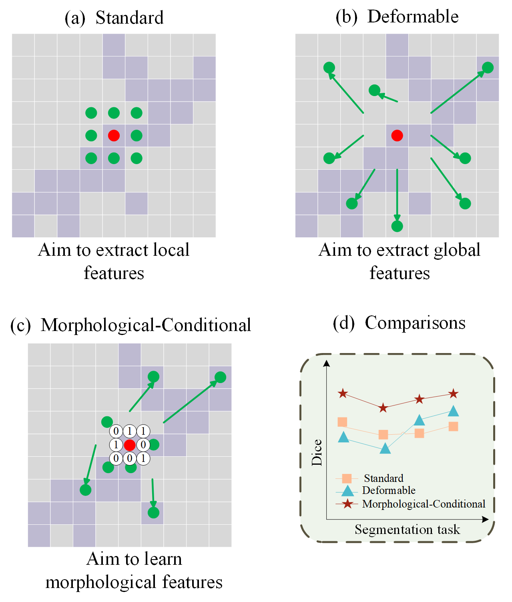
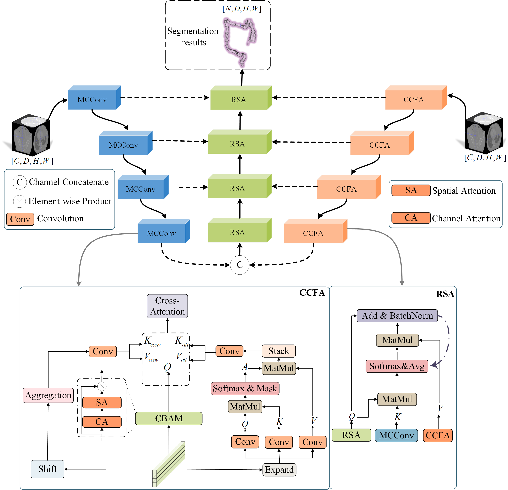
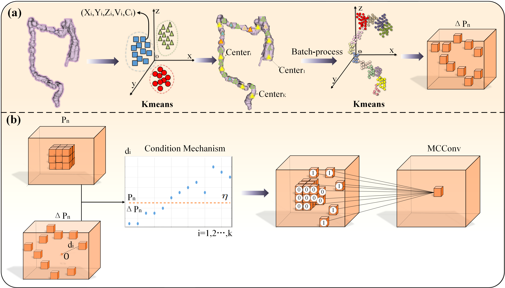

# MCDNet: Morphological-Conditional Dual-view Fusion for 3D Tubular Structure Segmentation

[](https://github.com/wzydcg/MCDNet)
[](https://github.com/wzydcg/MCDNet)


---

## Introduction

## Approach



## Morphological-Conditional Convolution


## Dataset

Download the RAOS dataset from [here](https://github.com/Luoxd1996/RAOS).

Download the CAS2023 dataset from [here](https://codalab.lisn.upsaclay.fr/competitions/9804#participate-get_starting_kit).

Download the MM-WHS dataset from [here](https://mega.nz/folder/UNMF2YYI#1cqJVzo4p_wESv9P_pc8uA).

Download the MSD dataset from [here](http://medicaldecathlon.com/).

## Training

### Default Scripts
All default hyperparameters among these models are tuned for RAOS datasets.

Wandb is needed if visualization of training parameters is wanted

### Customized Execution

run script like this:
```bash
python main.py \
--model Our_UNet \
--dataset RAOS \
--batch_size 4 \
--num_epochs 200 \
--learning_rate 1e-4 \
--dropout 0.1 \
--do_train \
--do_evaluate
```

## Dependencies
- python==3.12
- opencv-python==4.7.0.68
- einops
- nilearn==0.10.4
- scikit-learn==1.3.2
- scipy
- torch==2.3.0
- pydicom==2.4.4
- pandas==1.5.3
- nibabel==5.2.1
- wandb

## Citation

```
@ARTICLE{
  author={Wang, Zhiyan and Wang, Changjian and Xu, Kele and Tang, Zhongshun and Zhuang, Yan and Zou, Jiani and Liu, Fangyi},
  journal={}, 
  title={MCDNet: Morphological-Conditional Dual-view Fusion for 3D Tubular Structure Segmentation}, 
  year={2025},
  volume={},
  number={},
  pages={},
  keywords={Tubular Structure Segmentation;Conditional Convolution;Dual-view Architecture},
  doi={}}

```

## Contact Us

If you are interested to leave a message, please feel free to send any email to us at ```wangzhiyan24@nudt.edu.cn```
